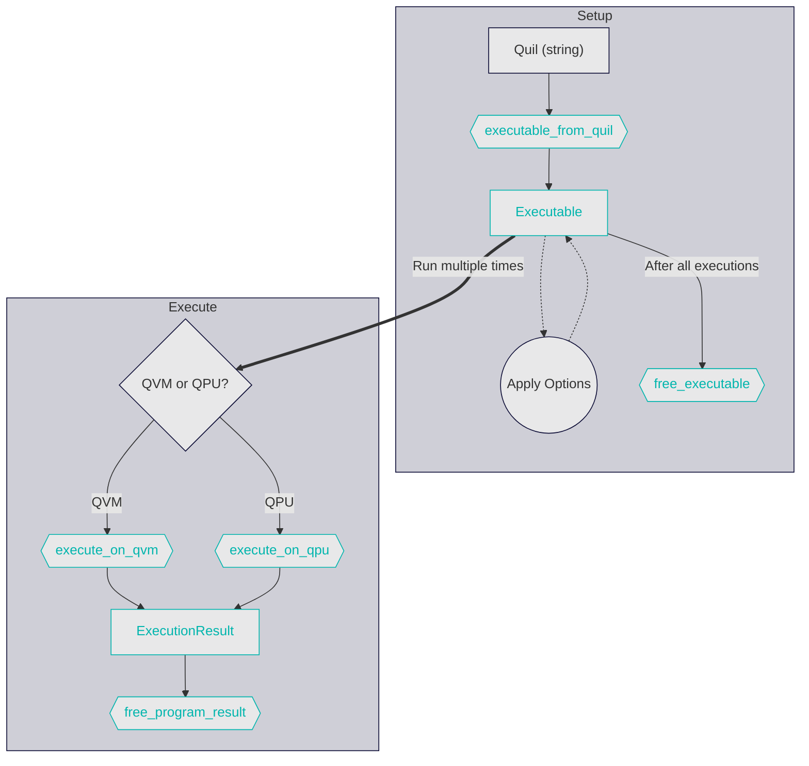

# Getting Started from C

## Basics

The point of `libqcs` is to allow you to run a [quil] program on [QCS]. The process generally looks like this:



You pass the string of a [Quil] program into [`executable_from_quil`]. You get back an [`Executable`] and check for any parsing/compilation errors. Then, configure the [`Executable`] with any options. Finally use either [`execute_on_qvm`] (for simulating results) or [`execute_on_qpu`] (for running against a real Quantum Computer) to get results. You may execute a single [`Executable`] multiple times with varying options for the same [Quil] program.

There are several options that can be applied to an [`Executable`] to achieve different effects:
- [`read_from`]
- [`set_param`]
- [`wrap_in_shots`]

## An Example

Let's walk through an example by reviewing some code used to test this library:

### Step 1: Include `libqcs.h`

```c
{{#include ../../c-lib/tests/integration_tests.c:include}}
```

### Step 2: Define a Quil Program

In this case, we have a constant program, but you could also write one dynamically at runtime.

```c
{{#include ../../c-lib/tests/integration_tests.c:program}}
```

### Step 3: Run the Program

Here we create an [`Executable`] using [`executable_from_quil`], then wrap it in 3 "shots" using [`wrap_in_shots`]. The number of shots is the number of times that the QPU will run a program per execution. We measured to memory called "ro"; that is the default, so we don't need to call [`read_from`]. [`execute_on_qvm`] runs the [`Executable`] on the locally-running QVM (simulated quantum computer). The return value is an [`ExecutionResult`] which contains either the resulting data or any error messages.

```c
{{#include ../../c-lib/tests/integration_tests.c:run}}
```

If we want to run on a real QPU, we swap out the function and add a parameter specifying which QPU to run against:

```c
    ExecutionResult result = execute_on_qpu(exe, "Aspen-9");
```

### Step 4: Handle Errors

If something goes wrong, [`ExecutionResult`] will be the [`Error`] variant. This field contains a human-readable description of the error.

```c
{{#include ../../c-lib/tests/integration_tests.c:errors}}
```

For the sake of our test cases, we have defined a function called `fail` which frees the memory of `result` and `exe` for us. **Make sure to always free all [`ExecutionResult`]s using [`free_execution_result`] and any [`Executable`] using [`free_executable`]**. 

### Step 5: Process Results

If there were no errors, then you can safely read your results out of `data_per_shot`! In this case, we know a successful response will be a [`Byte`] variant since we read out of `BIT` memory.

```c
{{#include ../../c-lib/tests/integration_tests.c:results}}
```

`data_per_shot` is a 2D array of bytes. There is an array representing the requested register per shot. In this case, there are 2 bits to read and three shots, so the data looks something like this:

```c
[[0, 0],[1, 1],[0, 0]]
```

### Step 6: Free the Memory

You must call [`free_executable`] and [`free_execution_result`] to deallocate [`Executable`] and [`ExecutionResult`] safely:

```c
{{#include ../../c-lib/tests/integration_tests.c:free}}
```

### All Together

Here's what the full integration test looks like from our test suite:

```c
{{#include ../../c-lib/tests/integration_tests.c:all}}
```

[quil]: https://github.com/quil-lang/quil
[qcs]: https://docs.rigetti.com/qcs/
[`executable_from_quil`]: api/executable_from_quil.md
[`Executable`]: api/executable.md
[`read_from`]: api/read_from.md
[`set_param`]: api/set_param.md
[`wrap_in_shots`]: api/wrap_in_shots.md
[`ExecutionResult`]: api/execution_result.md
[`Byte`]: api/execution_result.md#byte
[`Error`]: api/execution_result.md#error
[`free_execution_result`]: api/free_execution_result.md
[`execute_on_qvm`]: api/execute_on_qvm.md
[`execute_on_qpu`]: api/execute_on_qpu.md
[`free_executable`]: api/free_executable.md